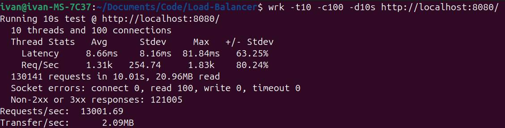

# ⚖️ Load Balancer

Балансировщик нагрузки на Go с reverse-proxy, rate limiting через Token Bucket, health checks и REST API для управления клиентами.

## Бенчмарк

429 (Too Many Requests) приходит из-за rate limiting.


## Quick Start

```bash
# С утилитой task
task start

# Без task
go run cmd/servers/servers.go --servers=10 --start_port=8100 &
docker compose up -d
go run cmd/loadBalancer/loadBalancer.go --path=config/config.yaml
```

## Task-команды

```bash
task start       # Запустить весь проект
task lb          # Только балансировщик
task lb-r        # Балансировщик с -race детектором
task servers     # Фейковые backend-серверы
task dk_up       # Поднять PostgreSQL в Docker
task dk_down     # Остановить контейнеры
task bench       # Нагрузочный тест (20000 запросов, 1000 соединений)
task bench-small # Лёгкий тест (5000 / 100)
```

## Clients API

```bash
# Создать клиента
curl -X POST http://localhost:8080/v1/api/clients/ \
  -H "Content-Type: application/json" \
  -d '{"ip_address": "127.0.0.1", "capacity": 100, "rate_per_second": 10}'

# Изменить клиента
curl -X PUT http://localhost:8080/v1/api/clients/127.0.0.1 \
  -H "Content-Type: application/json" \
  -d '{"capacity": 200, "rate_per_second": 50}'

# Получить всех клиентов
curl -X GET http://localhost:8080/v1/api/clients/

# Удалить клиента
curl -X DELETE http://localhost:8080/v1/api/clients/127.0.0.1
```

Swagger-документация: `docs/swagger.yaml`

## Функциональность

- Reverse-proxy с несколькими алгоритмами балансировки
- Rate limiting через Token Bucket (конфигурация на клиента)
- Health checks бэкендов с автоматическим исключением упавших
- Хранение конфигураций клиентов в PostgreSQL
- Локальный кэш клиентов (`sync.Map`)
- Graceful Shutdown по SIGTERM/SIGINT
- Конфигурация через YAML-файл

## Конкурентность

- `atomic` — доступность бэкенда и количество токенов у клиента
- Подсчитывающий семафор — ограничение параллельности health checks
- `sync.Map` — потокобезопасный локальный кэш клиентов

## Архитектура

Трёхслойная архитектура с инъекцией зависимостей: `controller` → `usecase` → `storage`. Интерфейсы располагаются по месту использования.